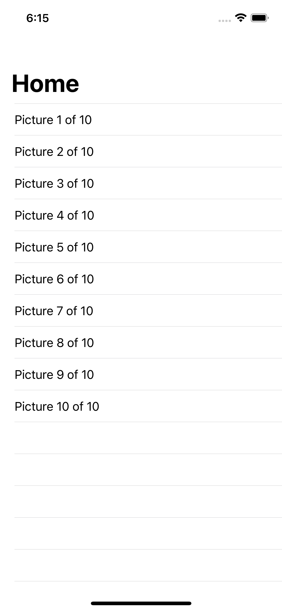
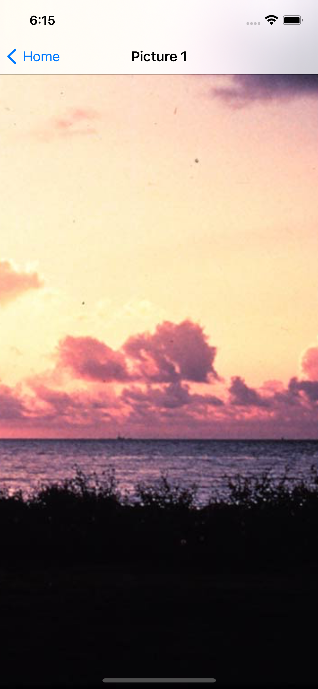

# Project 1

March 22nd 2021

|                        |                        |
|:----------------------:|:----------------------:|
|   |   |

## [Project 1, Part One](https://www.hackingwithswift.com/100/16)

* [Setting up](https://www.hackingwithswift.com/read/1/1/setting-up)
* [Listing images with FileManager](https://www.hackingwithswift.com/read/1/2/listing-images-with-filemanager)
* [Designing our interface](https://www.hackingwithswift.com/read/1/3/designing-our-interface)

## [Project 1, Part Two](https://www.hackingwithswift.com/100/17)

* [Building a detail screen](https://www.hackingwithswift.com/read/1/4/building-a-detail-screen)
* [Loading images with UIImage](https://www.hackingwithswift.com/read/1/5/loading-images-with-uiimage)
* [Final tweaks: hidesBarsOnTap, safe area margins](https://www.hackingwithswift.com/read/1/6/final-tweaks-hidesbarsontap-safe-area-margins)

## [Project 1, Part Three](https://www.hackingwithswift.com/100/18)

* [Wrap up](https://www.hackingwithswift.com/read/1/7/wrap-up)
* [Review for Project 1: Storm Viewer](https://www.hackingwithswift.com/review/hws/project-1-storm-viewer)