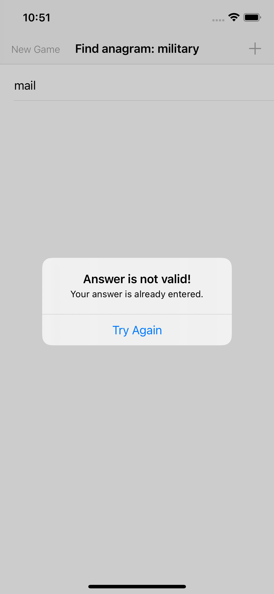

# Project 5

April 4nd 2021

|                        |                        |                        |                        |
|:----------------------:|:----------------------:|:----------------------:|:----------------------:|
|  |  |   |   |

## [Project 5, Part One](https://www.hackingwithswift.com/100/27)

* [Capture lists in Swift: what’s the difference between weak, strong, and unowned references?](https://www.hackingwithswift.com/articles/179/capture-lists-in-swift-whats-the-difference-between-weak-strong-and-unowned-references)
* [Setting up](https://www.hackingwithswift.com/read/5/1/setting-up)
* [Reading from disk: contentsOfFile](https://www.hackingwithswift.com/read/5/2/reading-from-disk-contentsoffile)
* [Pick a word, any word: UIAlertController](https://www.hackingwithswift.com/read/5/3/pick-a-word-any-word-uialertcontroller)

### Strong Capturing

Unless you ask for something special, Swift uses strong capturing. This means the closure will capture any external values that are used inside the closure, and make sure they never get destroyed.

~~~
func sing() -> () -> Void {
    let taylor = Singer()

    let singing = {
        taylor.playSong()
        return
    }

    return singing
}
~~~

That taylor constant is made inside the sing() function, so normally it would be destroyed when the function ends. However, it gets used inside the closure, which means Swift will automatically make sure it stays alive for as long as the closure exists somewhere, even after the function has returned.

This is strong capturing in action. If Swift allowed taylor to be destroyed, then the closure would no longer be safe to call – its taylor.playSong() method wouldn’t be valid any more.

### Weak capturing

Swift lets us specify a capture list to determine how values used inside the closure should be captured. The most common alternative to strong capturing is called weak capturing, and it changes two things:

1. Weakly captured values aren’t kept alive by the closure, so they might be destroyed and be set to nil.
2. As a result of 1, weakly captured values are always optional in Swift. This stops you assuming they are present when in fact they might not be.

We can modify our example to use weak capturing and you’ll see an immediate difference:

~~~
func sing() -> () -> Void {
    let taylor = Singer()

    let singing = { [weak taylor] in
        taylor?.playSong()
        return
    }

    return singing
}
~~~

That [weak taylor] part is our capture list, which is a specific part of closures where we give specific instructions as to how values should be captured. Here we’re saying that taylor should be captured weakly, which is why we need to use taylor?.playSong() – it’s an optional now, because it could be set to nil at any time.

If you run the code now you’ll see that calling singFunction() doesn’t print anything any more. The reason is that taylor exists only inside sing(), because the closure it returns doesn’t keep a strong hold of it.

To see this behavior in action, try changing sing() to this:

~~~
func sing() -> () -> Void {
    let taylor = Singer()

    let singing = { [weak taylor] in
        taylor!.playSong()
        return
    }

    return singing
}
~~~

That force unwraps taylor inside the closure, which will cause your code to crash because taylor becomes nil.

### Unowned capturing

An alternative to weak is unowned, which behaves more like implicitly unwrapped optionals. Like weak capturing, unowned capturing allows values to become nil at any point in the future. However, you can work with them as if they are always going to be there – you don’t need to unwrap optionals.

For example:

~~~
func sing() -> () -> Void {
    let taylor = Singer()

    let singing = { [unowned taylor] in
        taylor.playSong()
        return
    }

    return singing
}
~~~

That will crash in a similar way to our force-unwrapped example from earlier: unowned taylor says I know for sure that taylor will always exist for the lifetime of the closure I’m sending back so I don’t need to hold on to the memory, but in practice taylor will be destroyed almost immediately so the code will crash.

You should use unowned very carefully indeed.

### Capture lists alongside parameters

When using capture lists and closure parameters together the capture list must always come first, then the word in to mark the start of your closure body – trying to put it after the closure parameters will stop your code from compiling.

~~~
writeToLog { [weak self] user, message in 
    self?.addToLog("\(user) triggered event: \(message)")
}
~~~

### Strong reference cycles

~~~
class House {
    var ownerDetails: (() -> Void)?

    func printDetails() {
        print("This is a great house.")
    }

    deinit {
        print("I'm being demolished!")
    }
}

class Owner {
    var houseDetails: (() -> Void)?

    func printDetails() {
        print("I own a house.")
    }

    deinit {
        print("I'm dying!")
    }
}
~~~

Now let’s create a strong reference cycle:

~~~
print("Creating a house and an owner")

do {
    let house = House()
    let owner = Owner()
    house.ownerDetails = owner.printDetails
    owner.houseDetails = house.printDetails
}

print("Done")
~~~

It will print “Creating a house and an owner” then “Done”, with neither deinitializer being called.

What’s happening here is that house has a property that points to a method of owner, and owner has a property that points to a method of house, so neither can be safely destroyed. In real code this causes memory that can’t be freed, known as a memory leak, which degrades system performance and can even cause your app to be terminated.

To fix this we need to create a new closure and use weak capturing for one or both values, like this:

~~~
print("Creating a house and an owner")

do {
    let house = House()
    let owner = Owner()
    house.ownerDetails = { [weak owner] in owner?.printDetails() }
    owner.houseDetails = { [weak house] in house?.printDetails() }
}

print("Done")
~~~

It isn’t necessary to have both values weakly captured – all that matters is that at least one is, because it allows Swift to destroy them both when necessary.

### Accidental strong references

Swift defaults to strong capturing, which can cause unintentional problems.

Going back to our singing example from earlier, consider this code:

~~~
func sing() -> () -> Void {
    let taylor = Singer()
    let adele = Singer()

    let singing = { [unowned taylor, adele] in
        taylor.playSong()
        adele.playSong()
        return
    }

    return singing
}
~~~

Now we have two values being captured by the closure, and both values are being used the same way inside the closure. However, only taylor is being captured as unowned – adele is being captured strongly, because the unowned keyword must be used for each captured value in the list.

Now, if you want taylor to be unowned but adele to be strongly captured, that’s fine. But if you want both to be unowned you need to say so:

~~~
[unowned taylor, unowned adele]
~~~

### Copies of closures

The last thing that trips people up is the way closures themselves are copied, because their captured data becomes shared amongst copies.

~~~
var numberOfLinesLogged = 0

let logger1 = {
    numberOfLinesLogged += 1
    print("Lines logged: \(numberOfLinesLogged)")
}

let logger2 = logger1
logger2()
logger1()
logger2()
~~~

The copy shares the same capturing values as its original, so whether we call the original or the copy you’ll see the log line count increasing.

That will now print that 1, 2, 3, and 4 lines have been logged, because both logger1 and logger2 are pointing at the same captured numberOfLinesLogged value.

### When to use strong, when to use weak, when to use unowned

1. If you know for sure your captured value will never go away while the closure has any chance of being called, you can use unowned. This is really only for the handful of times when weak would cause annoyances to use, but even when you could use guard let inside the closure with a weakly captured variable.

2. If you have a strong reference cycle situation – where thing A owns thing B and thing B owns thing A – then one of the two should use weak capturing. This should usually be whichever of the two will be destroyed first, so if view controller A presents view controller B, view controller B might hold a weak reference back to A.

3. If there’s no chance of a strong reference cycle you can use strong capturing. For example, performing animation won’t cause self to be retained inside the animation closure, so you can use strong capturing.
   
4. If you’re not sure which to use, start out with weak and change only if you need to.

## [Project 5, Part Two](https://www.hackingwithswift.com/100/28)

* [Prepare for submission: lowercased() and IndexPath](https://www.hackingwithswift.com/read/5/4/prepare-for-submission-lowercased-and-indexpath)
* [Checking for valid answers](https://www.hackingwithswift.com/read/5/5/checking-for-valid-answers)
* [Or else what?](https://www.hackingwithswift.com/read/5/6/or-else-what)

**UITextChecker** is an iOS class that is designed to spot spelling errors, which makes it perfect for knowing if a given word is real or not. We're creating a new instance of the class and putting it into the checker constant for later.

**NSRange** is used to store a string range, which is a value that holds a start position and a length. We want to examine the whole string, so we use 0 for the start position and the string's length for the length.

Calling **rangeOfMisspelledWord(in:)** returns another NSRange structure, which tells us where the misspelling was found. But what we care about was whether any misspelling was found, and if nothing was found our NSRange will have the special location NSNotFound. Usually location would tell you where the misspelling started, but NSNotFound is telling us the word is spelled correctly – i.e., it's a valid word.

>NOTE
>>NSRange pre-dates Swift, and therefore doesn’t have access to optionals – NSNotFound is effectively a magic number that means “not found”, assigned to a constant to make it easier to use.

>NOTE
>>Swift’s strings natively store international characters as individual characters, e.g. the letter “é” is stored as precisely that. However, UIKit was written in Objective-C before Swift’s strings came along, and it uses a different character system called UTF-16 – short for 16-bit Unicode Transformation Format – where the accent and the letter are stored separately.

>>It’s a subtle difference, and often it isn’t a difference at all, but it’s becoming increasingly problematic because of the rise of emoji – those little images that are frequently used in messages. Emoji are actually just special character combinations behind the scenes, and they are measured differently with Swift strings and UTF-16 strings: Swift strings count them as 1-letter strings, but UTF-16 considers them to be 2-letter strings. This means if you use count with UIKit methods, you run the risk of miscounting the string length.

>>I realize this seems like pointless additional complexity, so let me try to give you a simple rule: when you’re working with UIKit, SpriteKit, or any other Apple framework, use utf16.count for the character count. If it’s just your own code - i.e. looping over characters and processing each one individually – then use count instead.

## [Project 5, Part Three](https://www.hackingwithswift.com/100/29)

[Custom UIBarButtonItem](https://stackoverflow.com/questions/31714978/setting-font-size-of-uibarbuttonitem)

[Autoreleasepool](https://stackoverflow.com/questions/25860942/is-it-necessary-to-use-autoreleasepool-in-a-swift-program/25880106)