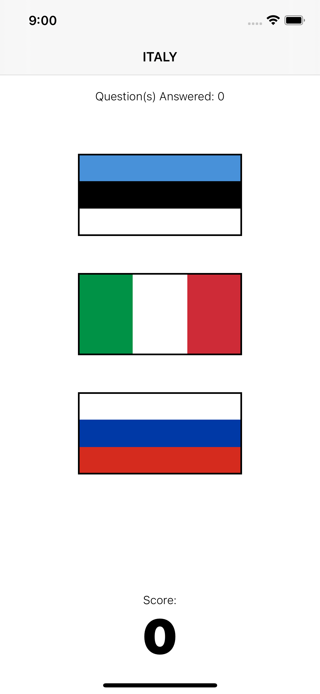
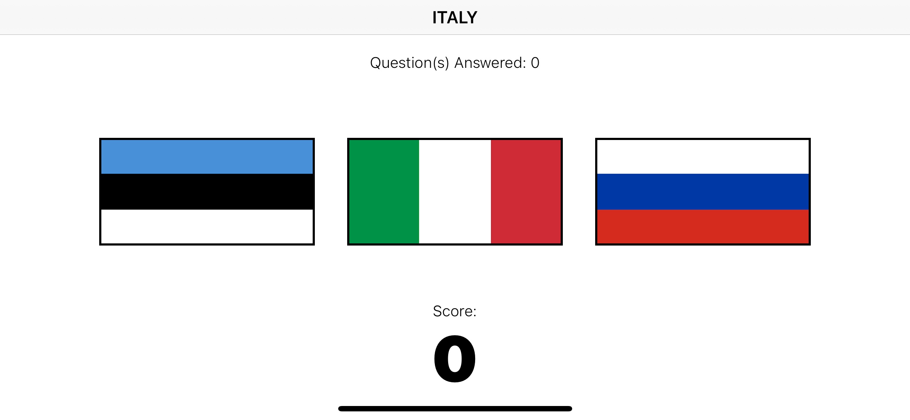
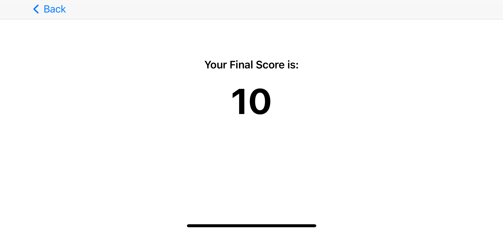

# Project 6

April 11th 2021

|                        |                        |                        |
|:----------------------:|:----------------------:|:----------------------:|
|   |   |   |

## [Project 6, Part One](https://www.hackingwithswift.com/100/30)

* [Setting up](https://www.hackingwithswift.com/read/6/1/setting-up)
* [Advanced Auto Layout](https://www.hackingwithswift.com/read/6/2/advanced-auto-layout)
* [Auto Layout in code: addConstraints() with Visual Format Language](https://www.hackingwithswift.com/read/6/3/auto-layout-in-code-addconstraints-with-visual-format-language)

[Adaptivity and Layout](https://developer.apple.com/design/human-interface-guidelines/ios/visual-design/adaptivity-and-layout/)
[Auto Layout Without Constraints](https://developer.apple.com/library/archive/documentation/UserExperience/Conceptual/AutolayoutPG/AutoLayoutWithoutConstraints.html#//apple_ref/doc/uid/TP40010853-CH8-SW1)
[Get safe area inset](https://stackoverflow.com/questions/46829840/get-safe-area-inset-top-and-bottom-heights/53864017)
[Detect orientation changes](https://stackoverflow.com/questions/38894031/swift-how-to-detect-orientation-changes)

## [Project 6, Part Two](https://www.hackingwithswift.com/100/31)

* [Auto Layout metrics and priorities: constraints(withVisualFormat:)](https://www.hackingwithswift.com/read/6/4/auto-layout-metrics-and-priorities-constraintswithvisualformat)
* [Auto Layout anchors](https://www.hackingwithswift.com/read/6/5/auto-layout-anchors)
* [Wrap up](https://www.hackingwithswift.com/read/6/6/wrap-up)
* [Review for Project 6: Auto Layout](https://www.hackingwithswift.com/review/hws/project-6-auto-layout)